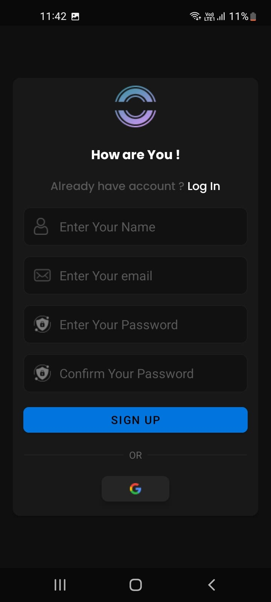
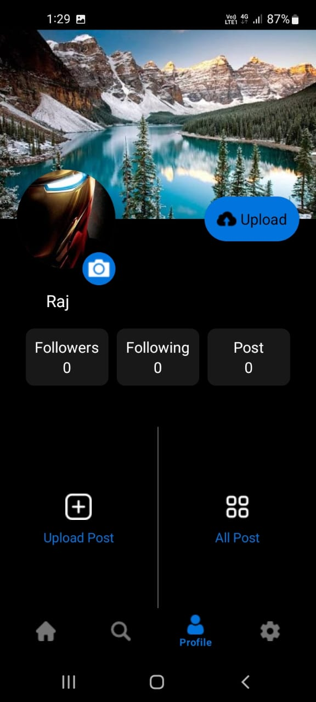
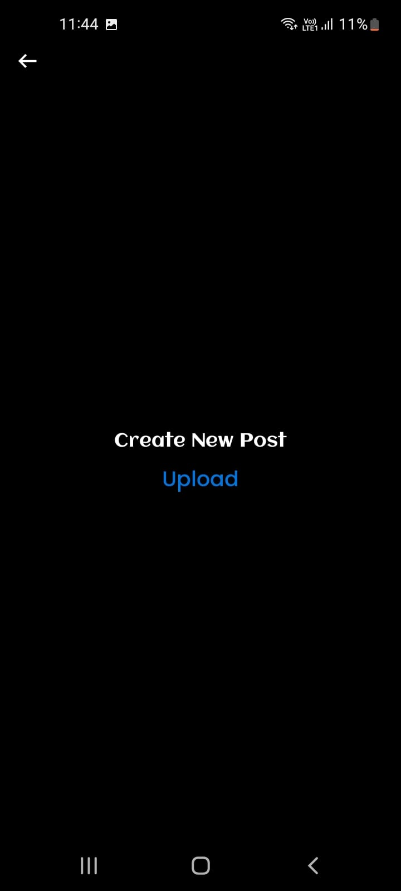
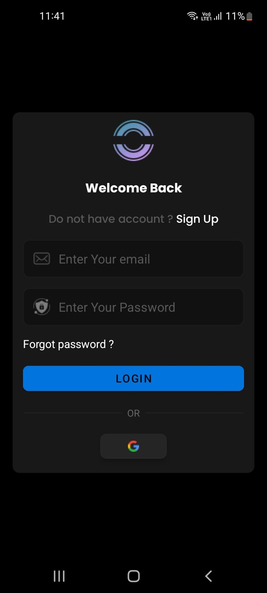

# Somana - Realtime Social Media App

A feature-rich Android social media application built with Kotlin and XML that allows users to create posts, view a realtime feed, and manage their profiles.
- Tools and Technologies: Kotlin, Firebase, XML
- Developed an social media app with real-time posts, stories, and user interactions (likes/comments).
- Implementing Firebase Realtime Database and Backendless storage for real-time updates, ensuring seamless feed synchronization and scalable data storage.
- Creating a dynamic UI with XML, including gesture-based navigation (swipeable posts, infinite scroll).

## 📱 Project Screenshots

| Login & Signup | Feed & Posts | User Profile |
|:--------------:|:------------:|:------------:|
|  |  |  |

| Create Post |
|:-----------:|
|  | 

## 🚀 Built With

* **Mobile Framework:** Android Native
* **Programming Language:** Kotlin
* **Layout & UI:** XML
* **Backend & Realtime Database:** Firebase Firestore
* **Authentication:** Firebase Authentication
* **Storage:** Firebase Storage (for images)
* **Architecture:** MVVM (Model-View-ViewModel)
* **Additional Libraries:**
  - Glide/Picasso (Image loading)
  - Android Architecture Components (LiveData, ViewModel)
  - Material Design Components

## 📋 Prerequisites

Before running this project, make sure you have:

- Android Studio (Arctic Fox or later recommended)
- Android SDK API level 23 (Marshmallow) or higher
- A device or emulator with Android 6.0+
- A Google account to configure Firebase

## 🔧 Installation Steps:

### 1. Clone the Repository
```bash
git clone https://github.com/warish121/Somana
```


### 2. Firebase Setup
1. Go to Firebase Console
2. Create a new project named "Somana"
3. Add an Android app to your project:
* Package name: com.example.anew
* Download the google-services.json file
6. Place the google-services.json file in your app/ directory

### 3. Configure Firebase Services
In your Firebase Console, enable the following services:
1. Authentication: Enable Email/Password sign-in method
2. Firestore Database: Create database in test mode
3. Storage: Start in test mode

### 4. Build and Run
1. Open the project in Android Studio
2. Sync the project with Gradle files
3. Build the project (Build > Make Project)
4. Run on an emulator or physical device

## 🔑 Environment Variables
This project uses Firebase configuration through the google-services.json file. No additional environment variables are needed for development.
Important Security Note: For production, consider:
* Restricting Firebase Security Rules
* Using environment variables for sensitive configurations
* Setting up proper app signing

## 👤 Student Routes (User Features)
Authentication Routes
* Splash Screen (SplashActivity.kt) - Initial loading and auth check
* Login Screen (LoginActivity.kt) - User authentication
* Signup Screen (SignupActivity.kt) - New user registration

### Main Application Routes
* Main Feed (Home_Page.kt) - View all posts in realtime
* Create Post (Upload_Post.kt) - Compose new posts
* User Profile (Profile_.kt) - View and edit user profile
* Post Details (PostDetailActivity.kt) - View individual post with comments

## 🎯 Key Features
### 🔄 Realtime Posts
* Instant post publishing and updates
* Live feed without manual refresh
* Real-time likes and comments counter

### 👥 User Management
* Secure email/password authentication
* User profile creation and editing
* Profile picture upload functionality

### 📝 Content Creation
* Post deletion (user's own posts only)
* Commenting system on posts
* Post liking and sharing features
* Search and filter functionality

## 👨‍💻 Developer
Mohd Warish

GitHub: @Warish

## 🖼️ Project Screenshots

### 📊 Signup View

 

### 📊 Login View
 


